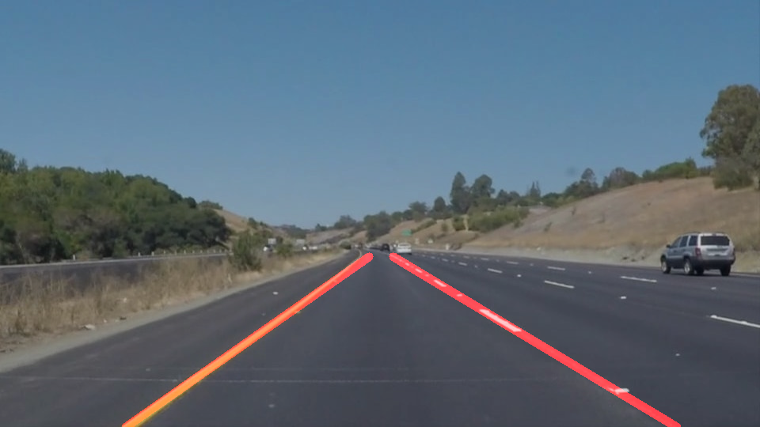
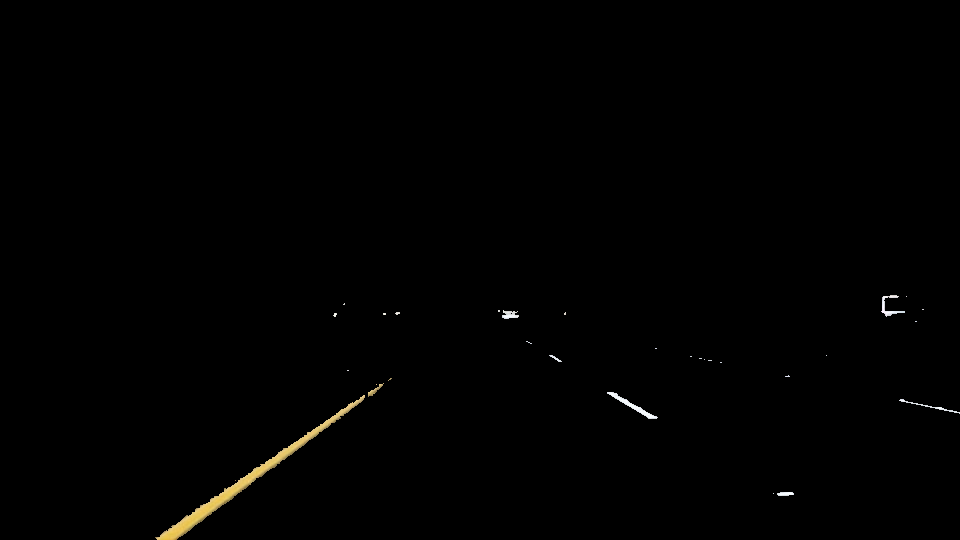
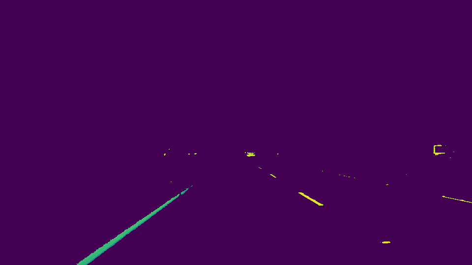

#**Finding Lane Lines on the Road** 

---

**Finding Lane Lines on the Road**

The goals / steps of this project are the following:

* Make a pipeline that finds lane lines on the road
* Reflect on your work in a written report

<iframe width="560" height="315" src="https://www.youtube.com/embed/xcEJ3FyzKTI" frameborder="0" allowfullscreen></iframe>

---

### Reflection

###1. Describe your pipeline. As part of the description, explain how you modified the draw_lines() function.

My pipeline consisted of 8 steps. 

* Sanintize the picture/frame by change into only white/yellow available
* Grayscale the picture/frame  
* Gaussian Blur
* Canny
* Calculate the mask array of lane lines
* Generate ROI
* Hough Line function by calling a custom draw_line() function

In order to draw a single line on the left and right lanes, I modified the draw_lines() function by using the least-squares curve-fitting

If you'd like to include images to show how the pipeline works, here is how to include an image: 

###2. Identify potential shortcomings with your current pipeline

* After grayscale() method called,  the whole backgroud of the picture become carmine and still finding answer. But it works by using the OpenCV cv2.imshow() method.

#####After sanitize_img() called#####

#####After grayscale() called#####

###3. Suggest possible improvements to your pipeline

A possible improvement would be to smoothing the lines

Another potential improvement could be to show the caculated angle of the corner.